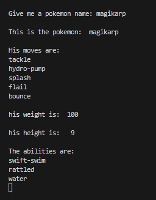

# Proyecto_Modulo_4
##  The pokemon API

1. Analyzing and reviewing the requierements, and the example
2. Inside the class is all the information, this is what I require for my idea of an App
3. I was very unmotivated, this module returned my interest
4. This is for to know where is the information
5. Very interesting tha we can get information of the API's
6. I'm finish de project, i'm suseccsfull
7. Is later and my english is not excelen, tomorrow will change language
8. my results are so good
9. this is the image to get to the API
 I hopw this is correct
10. I up tow images of diferent form: first i take a screen shot and paste in the README file and i give 
    name, the second form is from the file in my OS i put in the file of my repository
11. I have a file text with the library with all weed for the code
12. The images are a examples for the code's answer
13. I forget to push and commit every change to the repositry
14. Now i know i have it, thank you